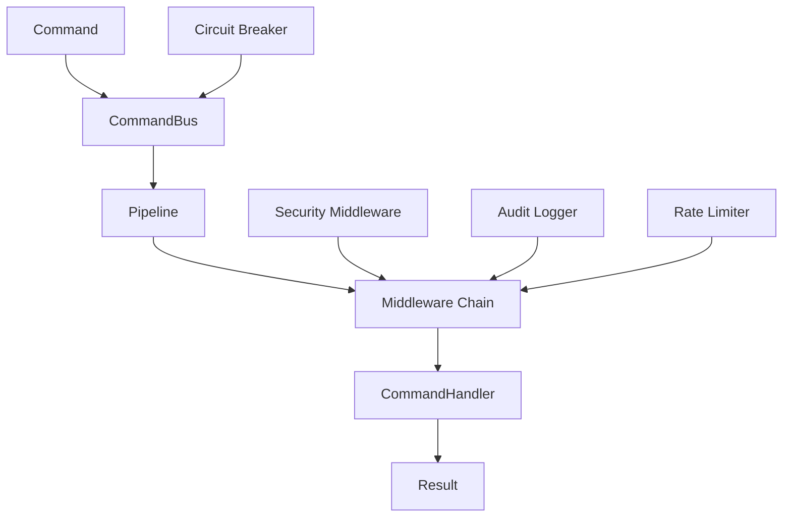

# PipelineKit

[](https://swift.org)
[](https://developer.apple.com/swift/)
[](LICENSE)

A comprehensive, security-first Command-Pipeline architecture framework for Swift 6, featuring full concurrency support, robust middleware chains, and enterprise-grade security features.

## 🌟 Features

### Core Architecture
- **Command Pattern**: Type-safe command execution with result handling
- **Pipeline/Filter Pattern**: Composable middleware chains for request processing
- **Swift 6 Concurrency**: Full `async`/`await` support with `Sendable` conformance
- **Thread Safety**: Actor-based isolation for concurrent operations
- **Context-Aware Pipelines**: State sharing between middleware components

### Security Features
- **🔒 Input Validation**: Comprehensive validation rules with custom validators
- **🧹 Data Sanitization**: HTML, SQL injection, and XSS protection
- **👮 Authorization**: Role-based access control with flexible rules
- **🚦 Rate Limiting**: Token bucket, sliding window, and adaptive strategies
- **⚡ Circuit Breaker**: Failure protection with automatic recovery
- **📊 Audit Logging**: Complete command execution tracking with privacy controls
- **🔐 Encryption**: AES-GCM encryption for sensitive data with key rotation
- **🛡️ Secure Error Handling**: Information leakage prevention

### Advanced Features
- **Middleware Ordering**: 51 predefined execution orders for security compliance
- **Concurrent Execution**: Parallel pipeline processing with load balancing
- **Priority Queues**: Weighted command execution for performance optimization
- **DoS Protection**: Multi-layer defense against denial-of-service attacks

## 🚀 Quick Start

### Installation

Add PipelineKit to your `Package.swift`:

```swift
dependencies: [
    .package(url: "https://github.com/yourorg/PipelineKit", from: "1.0.0")
]
```

### Basic Usage

```swift
import PipelineKit

// Define a command
struct CreateUserCommand: Command {
    let email: String
    let username: String
    
    typealias Result = User
}

// Create a handler
struct CreateUserHandler: CommandHandler {
    func handle(_ command: CreateUserCommand) async throws -> User {
        // Validate and create user
        return User(email: command.email, username: command.username)
    }
}

// Set up the command bus
let bus = CommandBus()
await bus.register(CreateUserCommand.self, handler: CreateUserHandler())

// Execute commands
let user = try await bus.send(
    CreateUserCommand(email: "user@example.com", username: "johndoe")
)
```

### Secure Pipeline Example

```swift
import PipelineKit

// Create a secure pipeline with ordered middleware
let secureBuilder = SecurePipelineBuilder()
    .add(ValidationMiddleware())
    .add(AuthorizationMiddleware(roles: ["admin", "user"]))
    .add(RateLimitingMiddleware(
        limiter: RateLimiter(
            strategy: .tokenBucket(capacity: 100, refillRate: 10)
        )
    ))
    .add(AuditLoggingMiddleware(
        logger: AuditLogger(destination: .file(url: auditLogURL))
    ))

let pipeline = secureBuilder.build()

// Execute with security middleware
let result = try await pipeline.execute(
    command,
    metadata: DefaultCommandMetadata(userId: "user123")
)
```

## 📖 Comprehensive Examples

### 1. Command with Validation

```swift
struct PaymentCommand: Command, ValidatableCommand {
    let amount: Double
    let cardNumber: String
    let email: String
    
    typealias Result = PaymentResult
    
    func validate() throws {
        try Validator.notEmpty(cardNumber, field: "cardNumber")
        try Validator.email(email)
        try Validator.range(amount, min: 0.01, max: 10000, field: "amount")
    }
}
```

### 2. Encrypted Sensitive Data

```swift
struct PaymentCommand: Command, EncryptableCommand {
    var cardNumber: String
    var cvv: String
    let amount: Double
    
    typealias Result = PaymentResult
    
    var sensitiveFields: [String: Any] {
        ["cardNumber": cardNumber, "cvv": cvv]
    }
    
    mutating func updateSensitiveFields(_ fields: [String: Any]) {
        if let cardNumber = fields["cardNumber"] as? String {
            self.cardNumber = cardNumber
        }
        if let cvv = fields["cvv"] as? String {
            self.cvv = cvv
        }
    }
}

// Usage with encryption
let encryptor = CommandEncryptor()
let encrypted = try await encryptor.encrypt(paymentCommand)
let decrypted = try await encryptor.decrypt(encrypted)
```

### 3. Context-Aware Processing

```swift
// Define context keys
struct UserKey: ContextKey {
    typealias Value = User
}

struct MetricsKey: ContextKey {
    typealias Value = RequestMetrics
}

// Create context-aware middleware
struct AuthenticationMiddleware: ContextAwareMiddleware {
    func execute<T: Command>(
        _ command: T,
        context: CommandContext,
        next: @Sendable (T, CommandContext) async throws -> T.Result
    ) async throws -> T.Result {
        // Authenticate and store user in context
        let user = try await authenticate(command)
        await context.set(UserKey.self, value: user)
        
        return try await next(command, context)
    }
}
```

### 4. Rate Limiting and Circuit Breaking

```swift
// Configure rate limiter
let rateLimiter = RateLimiter(
    strategy: .adaptive(
        baseRate: 100,
        loadFactor: { await systemLoad() }
    ),
    scope: .perUser
)

// Configure circuit breaker
let circuitBreaker = CircuitBreaker(
    failureThreshold: 5,
    timeout: 30.0
)

// Secure dispatcher with both
let dispatcher = SecureCommandDispatcher(
    bus: bus,
    rateLimiter: rateLimiter,
    circuitBreaker: circuitBreaker
)
```

### 5. Audit Logging

```swift
// Configure audit logger
let auditLogger = AuditLogger(
    destination: .file(url: URL(fileURLWithPath: "/var/log/commands.json")),
    privacyLevel: .masked,
    bufferSize: 1000
)

// Query audit logs
let criteria = AuditQueryCriteria(
    startDate: Date().addingTimeInterval(-3600), // Last hour
    userId: "user123",
    success: false // Failed commands only
)

let failedCommands = await auditLogger.query(criteria)

// Generate statistics
let stats = AuditStatistics.calculate(from: failedCommands)
print("Failure rate: \(1.0 - stats.successRate)")
```

## 🏗️ Architecture

### Command Flow

```
Request → Validation → Authorization → Rate Limiting → Business Logic → Audit → Response
```

### Middleware Stack

```swift
public enum MiddlewareOrder: Int, Sendable, CaseIterable {
    // Pre-Processing (0-99)
    case correlation = 10
    case requestId = 20
    case tracing = 30
    
    // Security (100-299)
    case authentication = 100
    case authorization = 200
    case validation = 300
    case sanitization = 310
    case rateLimiting = 320
    case encryption = 330
    
    // Traffic Control (400-499)
    case loadBalancing = 400
    case circuitBreaker = 410
    case timeout = 420
    case retry = 430
    
    // And 40+ more predefined orders...
}
```

### Core Components



## 🔒 Security Features

### Input Validation

```swift
// Built-in validators
try Validator.notEmpty(value, field: "username")
try Validator.email(email)
try Validator.alphanumeric(username)
try Validator.length(password, min: 8, max: 128)
try Validator.regex(phoneNumber, pattern: #"^\+?[1-9]\d{1,14}$"#)

// Custom validators
try Validator.custom(value) { value in
    guard isValid(value) else {
        throw ValidationError.custom("Invalid value")
    }
}
```

### Data Sanitization

```swift
// HTML sanitization
let safe = Sanitizer.html(userInput)

// SQL injection prevention
let safe = Sanitizer.sql(userInput)

// Remove non-printable characters
let safe = Sanitizer.removeNonPrintable(userInput)

// Truncate to safe length
let safe = Sanitizer.truncate(userInput, maxLength: 1000)
```

### Rate Limiting Strategies

```swift
// Token bucket (burst tolerance)
let strategy = RateLimitStrategy.tokenBucket(capacity: 100, refillRate: 10)

// Sliding window (accurate)
let strategy = RateLimitStrategy.slidingWindow(windowSize: 60, maxRequests: 100)

// Adaptive (load-based)
let strategy = RateLimitStrategy.adaptive(baseRate: 100) {
    await getCurrentSystemLoad()
}
```

## 📊 Performance

PipelineKit is designed for high-performance scenarios:

- **Concurrent Execution**: Process multiple commands in parallel
- **Actor-Based Isolation**: Thread-safe without locks
- **Memory Efficient**: Minimal allocations with value types
- **Benchmarked**: Thoroughly tested for performance characteristics

### Benchmarks

```
Pipeline execution time: 0.006ms per command
Concurrent pipeline: 0.011ms per command
Memory usage: <1MB for 10,000 commands
```

## 🧪 Testing

Comprehensive test suite with 86 tests covering:

- ✅ Core functionality (Commands, Handlers, Pipelines)
- ✅ Security features (Validation, Authorization, Encryption)
- ✅ Concurrency and thread safety
- ✅ Performance characteristics
- ✅ Error handling and edge cases

Run tests:

```bash
swift test
```

## 📚 Documentation

- [Security Best Practices](SECURITY.md) - Essential security guidelines
- [API Documentation](https://docs.pipelinekit.dev) - Complete API reference
- [Migration Guide](MIGRATION.md) - Upgrading from previous versions
- [Examples](Examples/) - Real-world usage examples

## 🤝 Contributing

We welcome contributions! Please see our [Contributing Guidelines](CONTRIBUTING.md) for details.

### Development Setup

```bash
git clone https://github.com/yourorg/PipelineKit
cd PipelineKit
swift build
swift test
```

## 📄 License

PipelineKit is released under the MIT License. See [LICENSE](LICENSE) for details.

## 🙏 Acknowledgments

- Built with Swift 6 and powered by structured concurrency
- Inspired by enterprise security patterns and best practices
- Designed for production-grade applications

---

**Security Notice**: This framework includes security features but requires proper implementation. Please review the [Security Best Practices](SECURITY.md) before production use.