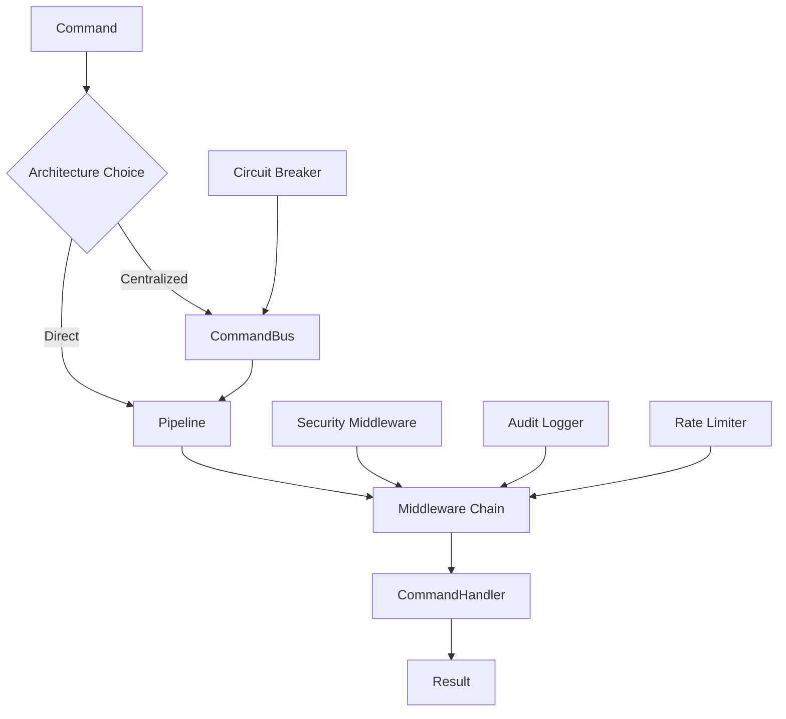

# PipelineKit

[](https://swift.org)
[](https://developer.apple.com/swift/)
[](LICENSE)

A comprehensive, security-first Command-Pipeline architecture framework for Swift, featuring full concurrency support, robust middleware chains, enterprise-grade security features, and Swift macro support for simplified pipeline creation.

## 🌟 Features

### Core Architecture
- **Command Pattern**: Type-safe command execution with result handling
- **Pipeline/Filter Pattern**: Composable middleware chains for request processing
- **Swift Concurrency**: Full `async`/`await` support with `Sendable` conformance
- **Thread Safety**: Actor-based isolation for concurrent operations
- **Context-Aware Pipelines**: State sharing between middleware components
- **Swift Macros**: `@Pipeline` macro for automatic implementation generation

### Security Features
- **🔒 Input Validation**: Comprehensive validation rules with custom validators
- **🧹 Data Sanitization**: HTML, SQL injection, and XSS protection
- **👮 Authorization**: Role-based access control with flexible rules
- **🚦 Rate Limiting**: Token bucket, sliding window, and adaptive strategies
- **⚡ Circuit Breaker**: Failure protection with automatic recovery
- **📊 Audit Logging**: Complete command execution tracking with privacy controls
- **🔐 Encryption**: AES-GCM encryption for sensitive data with key rotation
- **🛡️ Secure Error Handling**: Information leakage prevention

### Advanced Features
- **Middleware Ordering**: 51 predefined execution orders for security compliance
- **Concurrent Execution**: Parallel pipeline processing with load balancing
- **Priority Queues**: Weighted command execution for performance optimization
- **DoS Protection**: Multi-layer defense against denial-of-service attacks
- **🔍 Observability**: Built-in tracing, metrics, and logging with PipelineObserver protocol
- **📈 Performance Monitoring**: Automatic performance tracking and threshold alerts
- **🌐 Distributed Tracing**: Span context propagation for microservices
- **📊 Custom Metrics**: Extensible metrics collection and reporting

## 🚀 Quick Start

### Installation

Add PipelineKit to your `Package.swift`:

```swift
dependencies: [
    .package(url: "https://github.com/yourorg/PipelineKit", from: "1.0.0")
]
```

### Basic Usage

```swift
import PipelineKit

// Define a command
struct CreateUserCommand: Command {
    let email: String
    let username: String
    
    typealias Result = User
}

// Create a handler
struct CreateUserHandler: CommandHandler {
    typealias CommandType = CreateUserCommand
    
    func handle(_ command: CreateUserCommand) async throws -> User {
        // Validate and create user
        return User(email: command.email, username: command.username)
    }
}

// Option 1: Direct Pipeline Usage (No CommandBus Required)
let pipeline = DefaultPipeline(handler: CreateUserHandler())
let user = try await pipeline.execute(
    CreateUserCommand(email: "user@example.com", username: "johndoe"),
    metadata: DefaultCommandMetadata()
)

// Option 2: CommandBus for Centralized Routing
let bus = CommandBus()
await bus.register(CreateUserCommand.self, handler: CreateUserHandler())
let user = try await bus.send(
    CreateUserCommand(email: "user@example.com", username: "johndoe")
)

// Option 3: Using the @Pipeline macro (Swift 5.10+)
@Pipeline
actor UserService {
    typealias CommandType = CreateUserCommand
    let handler = CreateUserHandler()
}

let service = UserService()
let user = try await service.execute(
    CreateUserCommand(email: "user@example.com", username: "johndoe"),
    metadata: DefaultCommandMetadata()
)
```

### @Pipeline Macro

The `@Pipeline` macro simplifies pipeline creation by automatically generating the required boilerplate:

```swift
@Pipeline(
    concurrency: .limited(10),
    middleware: [ValidationMiddleware, LoggingMiddleware],
    maxDepth: 50,
    context: .enabled
)
actor PaymentService {
    typealias CommandType = PaymentCommand
    let handler = PaymentHandler()
}

// The macro generates:
// - var _executor: pipeline property
// - func execute(_:metadata:) method
// - func batchExecute(_:metadata:) method  
// - setupMiddleware() for middleware configuration
// - extension PaymentService: Pipeline conformance
```

### Direct Pipeline vs CommandBus Examples

#### Direct Pipeline - Type-Safe, Direct Execution

```swift
import PipelineKit

// Create a secure pipeline with ordered middleware
let secureBuilder = SecurePipelineBuilder()
    .add(ValidationMiddleware())
    .add(AuthorizationMiddleware(roles: ["admin", "user"]))
    .add(RateLimitingMiddleware(
        limiter: RateLimiter(
            strategy: .tokenBucket(capacity: 100, refillRate: 10)
        )
    ))
    .add(AuditLoggingMiddleware(
        logger: AuditLogger(destination: .file(url: auditLogURL))
    ))

let pipeline = secureBuilder.build()

// Direct execution - no CommandBus needed
let result = try await pipeline.execute(
    command,
    metadata: DefaultCommandMetadata(userId: "user123")
)
```

#### CommandBus - Centralized Routing

```swift
// Set up the command bus with centralized configuration
let bus = CommandBus()

// Register handlers with shared middleware
let sharedMiddleware = [
    ValidationMiddleware(),
    AuthorizationMiddleware(),
    AuditLoggingMiddleware()
]

// Register multiple command types
await bus.register(CreateUserCommand.self, 
                  handler: CreateUserHandler(),
                  middleware: sharedMiddleware)
await bus.register(PaymentCommand.self, 
                  handler: PaymentHandler(),
                  middleware: sharedMiddleware + [EncryptionMiddleware()])

// Route commands through unified interface
let user = try await bus.send(CreateUserCommand(email: "user@example.com"))
let payment = try await bus.send(PaymentCommand(amount: 99.99))
```

## 📖 Comprehensive Examples

### 1. Command with Validation

```swift
struct PaymentCommand: Command, ValidatableCommand {
    let amount: Double
    let cardNumber: String
    let email: String
    
    typealias Result = PaymentResult
    
    func validate() throws {
        try Validator.notEmpty(cardNumber, field: "cardNumber")
        try Validator.email(email)
        try Validator.range(amount, min: 0.01, max: 10000, field: "amount")
    }
}
```

### 2. Encrypted Sensitive Data

```swift
struct PaymentCommand: Command, EncryptableCommand {
    var cardNumber: String
    var cvv: String
    let amount: Double
    
    typealias Result = PaymentResult
    
    var sensitiveFields: [String: Any] {
        ["cardNumber": cardNumber, "cvv": cvv]
    }
    
    mutating func updateSensitiveFields(_ fields: [String: Any]) {
        if let cardNumber = fields["cardNumber"] as? String {
            self.cardNumber = cardNumber
        }
        if let cvv = fields["cvv"] as? String {
            self.cvv = cvv
        }
    }
}

// Usage with encryption
let encryptor = CommandEncryptor()
let encrypted = try await encryptor.encrypt(paymentCommand)
let decrypted = try await encryptor.decrypt(encrypted)
```

### 3. Context-Aware Processing

```swift
// Define context keys
struct UserKey: ContextKey {
    typealias Value = User
}

struct MetricsKey: ContextKey {
    typealias Value = RequestMetrics
}

// Create context-aware middleware
struct AuthenticationMiddleware: ContextAwareMiddleware {
    func execute<T: Command>(
        _ command: T,
        context: CommandContext,
        next: @Sendable (T, CommandContext) async throws -> T.Result
    ) async throws -> T.Result {
        // Authenticate and store user in context
        let user = try await authenticate(command)
        await context.set(UserKey.self, value: user)
        
        return try await next(command, context)
    }
}
```

### 4. Rate Limiting and Circuit Breaking

```swift
// Configure rate limiter
let rateLimiter = RateLimiter(
    strategy: .adaptive(
        baseRate: 100,
        loadFactor: { await systemLoad() }
    ),
    scope: .perUser
)

// Configure circuit breaker
let circuitBreaker = CircuitBreaker(
    failureThreshold: 5,
    timeout: 30.0
)

// Secure dispatcher with both
let dispatcher = SecureCommandDispatcher(
    bus: bus,
    rateLimiter: rateLimiter,
    circuitBreaker: circuitBreaker
)
```

### 5. Audit Logging

```swift
// Configure audit logger
let auditLogger = AuditLogger(
    destination: .file(url: URL(fileURLWithPath: "/var/log/commands.json")),
    privacyLevel: .masked,
    bufferSize: 1000
)

// Query audit logs
let criteria = AuditQueryCriteria(
    startDate: Date().addingTimeInterval(-3600), // Last hour
    userId: "user123",
    success: false // Failed commands only
)

let failedCommands = await auditLogger.query(criteria)

// Generate statistics
let stats = AuditStatistics.calculate(from: failedCommands)
print("Failure rate: \(1.0 - stats.successRate)")
```

## 🏗️ Architecture

### Pipeline vs CommandBus

PipelineKit offers flexible architecture options:

**Direct Pipeline Usage** - Execute commands through pipelines without CommandBus:
```swift
// Create pipeline with middleware
let pipeline = DefaultPipeline(handler: PaymentHandler())
let payment = try await pipeline.execute(paymentCommand, metadata: metadata)

// Benefits: Direct execution, explicit control, type safety
// Use when: Single command type, simple routing, performance critical
```

**CommandBus Orchestration** - Centralized command routing and management:
```swift
// Register multiple handlers
let bus = CommandBus()
await bus.register(CreateUserCommand.self, handler: CreateUserHandler())
await bus.register(PaymentCommand.self, handler: PaymentHandler())

// Route commands to appropriate handlers
let user = try await bus.send(CreateUserCommand(...))
let payment = try await bus.send(PaymentCommand(...))

// Benefits: Centralized routing, dynamic registration, request/response abstraction
// Use when: Multiple command types, dynamic routing, service layer
```

### When to Use Each Approach

| Scenario | Direct Pipeline | CommandBus | 
|----------|----------------|------------|
| **Single Command Type** | ✅ Recommended | ❌ Overkill |
| **Multiple Commands** | ⚠️ Complex | ✅ Recommended |
| **Microservice** | ✅ Direct control | ⚠️ Consider |
| **API Gateway** | ❌ Too granular | ✅ Perfect |
| **Performance Critical** | ✅ Lower overhead | ⚠️ Extra layer |
| **Dynamic Routing** | ❌ Static | ✅ Built-in |

### Command Flow

```
Request → Validation → Authorization → Rate Limiting → Business Logic → Audit → Response
```

### Thread Safety & Actor Isolation

PipelineKit uses Swift's actor model for guaranteed thread safety in critical components:

```swift
// Pipeline builders are now actors for safe concurrent configuration
let builder = PipelineBuilder(handler: myHandler)
await builder.with(ValidationMiddleware())
await builder.with(AuthorizationMiddleware())
let pipeline = await builder.build()

// CommandBus builder with actor isolation
let busBuilder = CommandBusBuilder()
await busBuilder.register(CreateUserHandler(), for: CreateUserCommand.self)
await busBuilder.enableCircuitBreaker(threshold: 5, timeout: 30)
let bus = await busBuilder.build()

// Security components use actors for thread-safe operations
let keyStore = InMemoryKeyStore()  // Actor-based key storage
await keyStore.rotateKeys()         // Safe concurrent access
```

All actor-based components ensure:
- ✅ No data races in concurrent environments
- ✅ Safe sharing across async boundaries
- ✅ Predictable state management
- ✅ Compile-time safety guarantees

## 🔧 Pipeline Types

PipelineKit provides multiple pipeline implementations, each optimized for different use cases:

### 1. **Standard Pipeline (DefaultPipeline)** - Sequential Processing

The fundamental pipeline executes middleware sequentially in a single thread.

**Best for:**
- Simple command processing
- Development and testing
- Low-complexity operations
- When order is critical

```swift
let pipeline = DefaultPipeline(handler: myHandler)
await pipeline.addMiddleware(ValidationMiddleware())
await pipeline.addMiddleware(AuthorizationMiddleware())
await pipeline.addMiddleware(AuditLoggingMiddleware())

// Sequential execution: Validation → Authorization → Audit → Handler
let result = try await pipeline.execute(command, metadata: metadata)
```

**Characteristics:**
- ✅ Predictable execution order
- ✅ Simple debugging
- ✅ Low memory overhead
- ❌ No parallelization
- ❌ Slower for I/O-heavy operations

---

### 2. **Concurrent Pipeline** - Parallel Processing

Executes independent middleware concurrently for improved performance.

**Best for:**
- I/O-heavy operations
- Independent middleware (validation, logging)
- High-throughput scenarios
- CPU-intensive tasks

```swift
let concurrentPipeline = ConcurrentPipeline(handler: myHandler, maxConcurrency: 4)
await concurrentPipeline.addMiddleware(ValidationMiddleware())    
await concurrentPipeline.addMiddleware(ExternalAPIMiddleware())  
await concurrentPipeline.addMiddleware(DatabaseMiddleware())      
await concurrentPipeline.addMiddleware(NotificationMiddleware())  

// Middleware executes with controlled concurrency
let result = try await concurrentPipeline.execute(command, metadata: metadata)
```

**Characteristics:**
- ✅ Faster execution for independent operations
- ✅ Better resource utilization
- ✅ Configurable concurrency limits
- ❌ More complex error handling
- ❌ Harder to debug race conditions

---

### 3. **Priority Pipeline** - Weighted Execution

Routes commands based on priority levels with weighted processing.

**Best for:**
- SLA-based processing
- VIP user prioritization
- Emergency command handling
- Resource-constrained environments

```swift
let priorityPipeline = PriorityPipeline(handler: myHandler)
await priorityPipeline.addMiddleware(ValidationMiddleware(), priority: .postProcessing)
await priorityPipeline.addMiddleware(SecurityMiddleware(), priority: .authentication)
await priorityPipeline.addMiddleware(LoggingMiddleware(), priority: .observability)

// Middleware executes in priority order (authentication → validation → handler → logging)
let result = try await priorityPipeline.execute(command, metadata: metadata)
```

**Characteristics:**
- ✅ Fair resource allocation
- ✅ SLA compliance
- ✅ Starvation prevention
- ❌ More complex configuration
- ❌ Potential latency for low-priority items

---

### 4. **Context-Aware Pipeline** - State Sharing

Enables middleware to share state through a command context.

**Best for:**
- Multi-step authentication flows
- Request correlation tracking
- Metrics collection across middleware
- Complex business logic requiring state

```swift
let contextPipeline = ContextAwarePipeline(handler: myHandler)
await contextPipeline.addMiddleware(RequestIdMiddleware())       // Sets request ID in context
await contextPipeline.addMiddleware(AuthenticationMiddleware())  // Sets user in context
await contextPipeline.addMiddleware(AuthorizationMiddleware())   // Uses user from context
await contextPipeline.addMiddleware(MetricsMiddleware())         // Collects timing data

// Context is shared between all middleware
let result = try await contextPipeline.execute(command, metadata: metadata)
```

**Context Usage Example:**
```swift
struct UserKey: ContextKey {
    typealias Value = User
}

struct AuthenticationMiddleware: ContextAwareMiddleware {
    func execute<T: Command>(
        _ command: T,
        context: CommandContext,
        next: @Sendable (T, CommandContext) async throws -> T.Result
    ) async throws -> T.Result {
        let user = try await authenticateUser(command)
        await context.set(UserKey.self, value: user)  // Store for other middleware
        return try await next(command, context)
    }
}

struct AuthorizationMiddleware: ContextAwareMiddleware {
    func execute<T: Command>(
        _ command: T,
        context: CommandContext,
        next: @Sendable (T, CommandContext) async throws -> T.Result
    ) async throws -> T.Result {
        guard let user = await context.get(UserKey.self) else {
            throw AuthorizationError.unauthenticated
        }
        // Use the user from context for authorization
        try await authorizeUser(user, for: command)
        return try await next(command, context)
    }
}
```

**Characteristics:**
- ✅ Rich inter-middleware communication
- ✅ Type-safe context access
- ✅ Perfect for complex flows
- ❌ Higher memory usage
- ❌ More complex middleware implementation

---

### 5. **Secure Pipeline** - Security-First Design

Pre-configured pipeline with security middleware in the correct order.

**Best for:**
- Production applications
- Financial services
- Healthcare systems
- Any security-sensitive application

```swift
let securePipeline = SecurePipelineBuilder()
    .add(ValidationMiddleware())           // Order: 300
    .add(AuthenticationMiddleware())       // Order: 100
    .add(AuthorizationMiddleware())        // Order: 200
    .add(RateLimitingMiddleware())         // Order: 320
    .add(SanitizationMiddleware())         // Order: 310
    .add(AuditLoggingMiddleware())         // Order: 800
    .build()  // Automatically sorts by security order

// Middleware executes in security-compliant order regardless of add() sequence
```

**Characteristics:**
- ✅ Automatic security ordering
- ✅ Production-ready defaults
- ✅ Comprehensive protection
- ❌ Less flexibility in ordering
- ❌ Higher overhead

---

## 🎯 Choosing the Right Pipeline

### Decision Matrix

| Use Case | Basic | Concurrent | Priority | Context-Aware | Secure |
|----------|-------|------------|----------|---------------|--------|
| **Simple CRUD** | ✅ | ❌ | ❌ | ❌ | ⚠️ |
| **High Throughput** | ❌ | ✅ | ⚠️ | ❌ | ⚠️ |
| **VIP Processing** | ❌ | ❌ | ✅ | ❌ | ⚠️ |
| **Complex Flows** | ❌ | ❌ | ❌ | ✅ | ⚠️ |
| **Production App** | ❌ | ⚠️ | ⚠️ | ⚠️ | ✅ |
| **Financial Services** | ❌ | ❌ | ❌ | ❌ | ✅ |
| **Microservices** | ❌ | ✅ | ⚠️ | ✅ | ✅ |

**Legend:** ✅ Recommended | ⚠️ Consider | ❌ Not Recommended

### Performance Characteristics

#### Pipeline Types
```
Latency (Lower is Better):
Basic < Context-Aware < Priority < Secure < Concurrent

Throughput (Higher is Better):
Concurrent > Priority > Basic > Context-Aware > Secure

Memory Usage (Lower is Better):
Basic < Priority < Concurrent < Secure < Context-Aware

Security (Higher is Better):
Secure > Context-Aware > Priority > Basic > Concurrent
```

#### Direct Pipeline vs CommandBus
```
Execution Overhead:
Direct Pipeline: ~0.006ms per command
CommandBus: ~0.008ms per command (+33% overhead)

Memory Usage:
Direct Pipeline: Minimal (handler + middleware)
CommandBus: Additional routing table + handler registry

Type Safety:
Direct Pipeline: Full compile-time type checking
CommandBus: Runtime type resolution

Flexibility:
Direct Pipeline: Static handler binding
CommandBus: Dynamic handler registration/routing
```

### Real-World Examples

#### E-commerce Platform

**Microservice Approach (Direct Pipelines)**
```swift
// Search Service - optimized for performance
class SearchService {
    private let pipeline = ConcurrentPipeline(handler: SearchHandler())
        .use(CacheMiddleware())
        .use(SearchMiddleware())
    
    func search(_ query: SearchCommand) async throws -> SearchResults {
        return try await pipeline.execute(query, metadata: metadata)
    }
}

// Payment Service - security-focused  
class PaymentService {
    private let pipeline = SecurePipelineBuilder()
        .add(PriorityMiddleware())  // VIP customers first
        .add(ValidationMiddleware())
        .add(AuthorizationMiddleware())
        .add(EncryptionMiddleware())
        .build()
    
    func processPayment(_ command: PaymentCommand) async throws -> PaymentResult {
        return try await pipeline.execute(command, metadata: metadata)
    }
}
```

**API Gateway Approach (CommandBus)**
```swift
// Centralized command routing for API gateway
class ECommerceAPI {
    private let bus = CommandBus()
    
    init() async {
        // Register all services through unified interface
        await bus.register(SearchCommand.self, handler: SearchHandler())
        await bus.register(PaymentCommand.self, handler: PaymentHandler()) 
        await bus.register(UserCommand.self, handler: UserHandler())
        await bus.register(OrderCommand.self, handler: OrderHandler())
    }
    
    func handle<T: Command>(_ command: T) async throws -> T.Result {
        return try await bus.send(command)  // Automatic routing
    }
}
```

#### Healthcare System

**Service-Oriented (Direct Pipelines)**
```swift
// Patient Records Service - context-aware for audit trail
class PatientRecordsService {
    private let pipeline = ContextAwarePipeline(handler: PatientHandler())
        .use(PatientContextMiddleware())     // Sets patient context
        .use(HIPAAComplianceMiddleware())    // Uses patient context
        .use(AuditMiddleware())              // Logs with full context
    
    func accessRecord(_ command: AccessPatientCommand) async throws -> PatientRecord {
        return try await pipeline.execute(command, metadata: metadata)
    }
}

// Emergency Service - priority-based
class EmergencyService {
    private let pipeline = PriorityPipeline(handler: EmergencyHandler())
    // Critical: Life-threatening (90% resources)
    // High: Urgent care (8% resources)  
    // Normal: Routine (2% resources)
    
    func handleEmergency(_ alert: EmergencyCommand) async throws -> EmergencyResponse {
        return try await pipeline.execute(alert, metadata: metadata)
    }
}
```

**Hospital Integration Platform (CommandBus)**
```swift
// Unified hospital system with centralized routing
class HospitalPlatform {
    private let bus = CommandBus()
    
    init() async {
        // Register all hospital services
        await bus.register(AccessPatientCommand.self, handler: PatientHandler())
        await bus.register(EmergencyCommand.self, handler: EmergencyHandler())
        await bus.register(ScheduleCommand.self, handler: SchedulingHandler())
        await bus.register(BillingCommand.self, handler: BillingHandler())
    }
    
    // Single entry point for all hospital operations
    func execute<T: Command>(_ command: T) async throws -> T.Result {
        return try await bus.send(command)
    }
}
```

#### Financial Trading System

**Trading Engine (Direct Pipelines)**
```swift
// Market Data Service - optimized for high throughput
class MarketDataService {
    private let pipeline = ConcurrentPipeline(handler: MarketDataHandler(), maxConcurrency: 8)
        .use(DataValidationMiddleware())
        .use(MarketAnalysisMiddleware())
        .use(DistributionMiddleware())
    
    func processMarketData(_ data: MarketDataCommand) async throws -> MarketUpdate {
        return try await pipeline.execute(data, metadata: metadata)
    }
}

// Trade Execution Service - security and compliance focused
class TradeExecutionService {
    private let pipeline = SecurePipelineBuilder()
        .add(PriorityMiddleware())           // Large orders first
        .add(RiskManagementMiddleware())
        .add(ComplianceMiddleware())
        .add(EncryptionMiddleware())
        .build()
    
    func executeTrade(_ trade: TradeCommand) async throws -> TradeResult {
        return try await pipeline.execute(trade, metadata: metadata)
    }
}
```

**Trading Platform (CommandBus)**
```swift
// Unified trading platform with regulatory oversight
class TradingPlatform {
    private let bus = CommandBus()
    
    init() async {
        // Register all trading operations
        await bus.register(MarketDataCommand.self, handler: MarketDataHandler())
        await bus.register(TradeCommand.self, handler: TradeExecutionHandler())
        await bus.register(RiskAssessmentCommand.self, handler: RiskHandler())
        await bus.register(ComplianceCommand.self, handler: ComplianceHandler())
        
        // Enable circuit breaker for system protection
        await bus.enableCircuitBreaker(threshold: 5, timeout: 30)
    }
    
    // All trading operations go through unified compliance pipeline
    func process<T: Command>(_ command: T) async throws -> T.Result {
        return try await bus.send(command)
    }
}
```

### Middleware Stack

```swift
public enum MiddlewareOrder: Int, Sendable, CaseIterable {
    // Pre-Processing (0-99)
    case correlation = 10
    case requestId = 20
    case tracing = 30
    
    // Security (100-299)
    case authentication = 100
    case authorization = 200
    case validation = 300
    case sanitization = 310
    case rateLimiting = 320
    case encryption = 330
    
    // Traffic Control (400-499)
    case loadBalancing = 400
    case circuitBreaker = 410
    case timeout = 420
    case retry = 430
    
    // And 40+ more predefined orders...
}
```

### Architectural Decision Guide

#### Choose Direct Pipeline When:
- ✅ Building microservices with single responsibilities
- ✅ Performance is critical (lower latency/overhead)
- ✅ You need compile-time type safety
- ✅ Working with a specific command type
- ✅ Building libraries or frameworks
- ✅ You want explicit control over execution

#### Choose CommandBus When:
- ✅ Building API gateways or service aggregators
- ✅ You need dynamic command routing
- ✅ Working with multiple command types
- ✅ You want centralized middleware configuration
- ✅ Building request/response abstractions
- ✅ You need runtime handler registration

#### Hybrid Approach
Combine both for maximum flexibility:

```swift
// Direct pipelines for individual services
class PaymentService {
    private let pipeline = SecurePipeline(handler: PaymentHandler())
    
    func processPayment(_ command: PaymentCommand) async throws -> PaymentResult {
        return try await pipeline.execute(command, metadata: metadata)
    }
}

// CommandBus for service orchestration
class APIGateway {
    private let bus = CommandBus()
    private let paymentService = PaymentService()
    
    init() async {
        // Wrap services in CommandBus for unified routing
        await bus.register(PaymentCommand.self) { command in
            return try await paymentService.processPayment(command)
        }
    }
}
```

### Core Components



## 🔒 Security Features

### Input Validation

```swift
// Built-in validators
try Validator.notEmpty(value, field: "username")
try Validator.email(email)
try Validator.alphanumeric(username)
try Validator.length(password, min: 8, max: 128)
try Validator.regex(phoneNumber, pattern: #"^\+?[1-9]\d{1,14}$"#)

// Custom validators
try Validator.custom(value) { value in
    guard isValid(value) else {
        throw ValidationError.custom("Invalid value")
    }
}
```

### Data Sanitization

```swift
// HTML sanitization
let safe = Sanitizer.html(userInput)

// SQL injection prevention
let safe = Sanitizer.sql(userInput)

// Remove non-printable characters
let safe = Sanitizer.removeNonPrintable(userInput)

// Truncate to safe length
let safe = Sanitizer.truncate(userInput, maxLength: 1000)
```

### Rate Limiting Strategies

```swift
// Token bucket (burst tolerance)
let strategy = RateLimitStrategy.tokenBucket(capacity: 100, refillRate: 10)

// Sliding window (accurate)
let strategy = RateLimitStrategy.slidingWindow(windowSize: 60, maxRequests: 100)

// Adaptive (load-based)
let strategy = RateLimitStrategy.adaptive(baseRate: 100) {
    await getCurrentSystemLoad()
}
```

## 🔍 Observability

PipelineKit provides comprehensive observability features for monitoring, debugging, and understanding your command execution:

### Pipeline Observer Protocol

Implement custom observers to track pipeline execution:

```swift
class MetricsObserver: PipelineObserver {
    func pipelineWillExecute<T: Command>(_ command: T, metadata: CommandMetadata, pipelineType: String) async {
        // Track command start
    }
    
    func pipelineDidExecute<T: Command>(_ command: T, result: T.Result, metadata: CommandMetadata, pipelineType: String, duration: TimeInterval) async {
        // Record success metrics
        recordMetric("command.success", value: 1, tags: ["command": String(describing: T.self)])
        recordMetric("command.duration", value: duration, tags: ["command": String(describing: T.self)])
    }
}

// Attach observers to any pipeline
let pipeline = DefaultPipeline(handler: handler)
    .withObservability(observers: [MetricsObserver(), OSLogObserver.production()])
```

### Built-in Observers

PipelineKit includes several pre-built observers for common use cases:

#### ConsoleObserver - Simple Console Logging
```swift
// Pretty formatted output for development
let devObserver = ConsoleObserver.development()

// Simple output for production
let prodObserver = ConsoleObserver.production()

// Detailed debugging output
let debugObserver = ConsoleObserver.debugging()

// Custom configuration
let customObserver = ConsoleObserver(
    style: .pretty,           // .simple, .detailed, .pretty
    level: .info,            // .verbose, .info, .warning, .error
    includeTimestamps: true
)
```

#### MemoryObserver - In-Memory Event Storage
```swift
// Store events for testing and debugging
let memoryObserver = MemoryObserver(options: .init(
    maxEvents: 10000,
    captureMiddlewareEvents: true,
    captureHandlerEvents: true,
    cleanupInterval: 3600  // Auto-cleanup old events
))

// Query captured events
let allEvents = await memoryObserver.allEvents()
let errorEvents = await memoryObserver.errorEvents()
let stats = await memoryObserver.statistics()
```

#### MetricsObserver - Metrics Collection
```swift
// Integrate with your metrics backend
let metricsObserver = MetricsObserver(
    backend: PrometheusBackend(),  // Or DatadogBackend, StatsDBackend, etc.
    configuration: .init(
        metricPrefix: "myapp.pipeline",
        includeCommandType: true,
        trackMiddleware: true,
        globalTags: ["environment": "production", "service": "api"]
    )
)

// Built-in backends for development
let consoleMetrics = MetricsObserver(backend: ConsoleMetricsBackend())
let inMemoryMetrics = MetricsObserver(backend: InMemoryMetricsBackend())
```

#### CompositeObserver - Combine Multiple Observers
```swift
// Combine multiple observers into one
let compositeObserver = CompositeObserver(
    ConsoleObserver.production(),
    MetricsObserver(backend: myBackend),
    OSLogObserver.production()
)
```

#### ConditionalObserver - Selective Observation
```swift
// Only observe specific commands
let paymentObserver = ConditionalObserver.forCommands(
    "PaymentCommand", "RefundCommand",
    observer: detailedLogger
)

// Only observe failures
let errorObserver = ConditionalObserver.onlyFailures(
    observer: alertingObserver
)

// Custom conditions
let customObserver = ConditionalObserver(
    wrapping: metricsObserver,
    when: { commandType, correlationId in
        commandType.contains("Critical") || correlationId?.hasPrefix("vip-") ?? false
    }
)
```

#### OSLog Integration
```swift
// Apple's unified logging system
let osLogObserver = OSLogObserver(configuration: .init(
    subsystem: "com.myapp.pipeline",
    logLevel: .info,
    includeCommandDetails: true,
    performanceThreshold: 1.0
))

// Pre-configured for common scenarios
let devObserver = OSLogObserver.development()
let prodObserver = OSLogObserver.production()
let perfObserver = OSLogObserver.performance()
```

### Observability Middleware

Automatic instrumentation for all commands:

```swift
let pipeline = ContextAwarePipeline(handler: handler)

// Add comprehensive observability
try await pipeline.addMiddleware(
    ObservabilityMiddleware(configuration: .init(
        observers: [OSLogObserver.development()],
        enablePerformanceMetrics: true
    ))
)

// Every command now has:
// - Automatic performance tracking
// - Distributed tracing context
// - Custom event emission
// - Error tracking
```

### Distributed Tracing

Track requests across service boundaries:

```swift
// Middleware automatically creates span contexts
struct DistributedTracingMiddleware: ContextAwareMiddleware {
    func execute<T: Command>(_ command: T, context: CommandContext, next: @Sendable (T, CommandContext) async throws -> T.Result) async throws -> T.Result {
        // Create or continue trace
        let span = await context.getOrCreateSpanContext(operation: String(describing: T.self))
        
        // Add service information
        await context.set(SpanContext(
            traceId: span.traceId,
            spanId: UUID().uuidString,
            parentSpanId: span.spanId,
            operation: "service.process",
            tags: ["service.name": "user-service", "service.version": "1.0.0"]
        ), for: SpanContextKey.self)
        
        return try await next(command, context)
    }
}
```

### Performance Monitoring

Track and alert on performance issues:

```swift
// Configure performance thresholds
let performanceMiddleware = PerformanceTrackingMiddleware(
    thresholds: .init(
        slowCommandThreshold: 1.0,    // Alert if command takes > 1 second
        slowMiddlewareThreshold: 0.1, // Alert if middleware takes > 100ms
        memoryUsageThreshold: 100     // Alert if memory increases > 100MB
    )
)

// Automatic performance tracking
try await pipeline.addMiddleware(performanceMiddleware)
```

### Custom Metrics

Emit custom events and metrics:

```swift
// Within any context-aware middleware or handler
await context.emitCustomEvent("payment.processed", properties: [
    "amount": 99.99,
    "currency": "USD",
    "payment_method": "credit_card"
])

// Track performance metrics
await context.startTimer("database.query")
let results = try await database.query(sql)
await context.endTimer("database.query")

// Record custom metrics
await context.recordMetric("cache.hit_rate", value: 0.95, unit: "ratio")
```

### Observable Commands

Commands can participate in observability:

```swift
struct ProcessOrderCommand: Command, ObservableCommand {
    let orderId: String
    typealias Result = Order
    
    func setupObservability(context: CommandContext) async {
        // Set up command-specific observability
        await context.setObservabilityData("order.id", value: orderId)
        await context.startTimer("order.processing")
    }
    
    func observabilityDidComplete<R>(context: CommandContext, result: R) async {
        await context.endTimer("order.processing")
        await context.emitCustomEvent("order.processed", properties: [
            "order_id": orderId,
            "status": "completed"
        ])
    }
    
    func observabilityDidFail(context: CommandContext, error: Error) async {
        await context.emitCustomEvent("order.failed", properties: [
            "order_id": orderId,
            "error": error.localizedDescription
        ])
    }
}
```

## 📊 Performance

PipelineKit is designed for high-performance scenarios:

- **Concurrent Execution**: Process multiple commands in parallel
- **Actor-Based Isolation**: Thread-safe without locks
- **Memory Efficient**: Minimal allocations with value types
- **Benchmarked**: Thoroughly tested for performance characteristics

### Benchmarks

```
Pipeline execution time: 0.006ms per command
Concurrent pipeline: 0.011ms per command
Memory usage: <1MB for 10,000 commands
```

## 🧪 Testing

Comprehensive test suite with 100+ tests covering:

- ✅ Core functionality (Commands, Handlers, Pipelines)
- ✅ Security features (Validation, Authorization, Encryption)
- ✅ Concurrency and thread safety
- ✅ Performance characteristics
- ✅ Error handling and edge cases

Run tests:

```bash
swift test
```

## 🔒 Security & Dependencies

### Dependency Management

PipelineKit has minimal dependencies for security:

```bash
# Audit dependencies
./Scripts/dependency-audit.sh

# Generate SBOM (Software Bill of Materials)
./Scripts/generate-sbom.sh
```

**Current Dependencies:**
- `swift-syntax` (510.0.3) - Apple's official macro implementation

All dependencies are:
- ✅ Pinned to exact versions
- ✅ Regularly audited for vulnerabilities
- ✅ From trusted sources
- ✅ License compatible (Apache-2.0)

See [DEPENDENCIES.md](DEPENDENCIES.md) for full policy.

## 📚 Documentation

- [Pipeline Types & Patterns](documentation/PIPELINES.md) - Comprehensive guide to choosing and configuring pipelines
- [Security Best Practices](documentation/SECURITY.md) - Essential security guidelines
- [Contributing Guidelines](documentation/CONTRIBUTING.md) - Development and contribution standards
- [AI Interface Documentation](documentation/AI_INTERFACE.txt) - LLM-optimized technical reference
- [Examples](Sources/PipelineKit/Examples/) - Real-world usage examples

## 🤝 Contributing

We welcome contributions! Please see our [Contributing Guidelines](documentation/CONTRIBUTING.md) for details.

### Development Setup

```bash
git clone https://github.com/yourorg/PipelineKit
cd PipelineKit
swift build
swift test
```

## 📄 License

PipelineKit is released under the MIT License. See [LICENSE](LICENSE) for details.

## 🙏 Acknowledgments

- Built with Swift 5.10+ and powered by structured concurrency
- Inspired by enterprise security patterns and best practices
- Designed for production-grade applications

---

**Security Notice**: This framework includes security features but requires proper implementation. Please review the [Security Best Practices](documentation/SECURITY.md) before production use.
